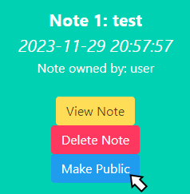
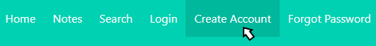
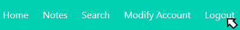
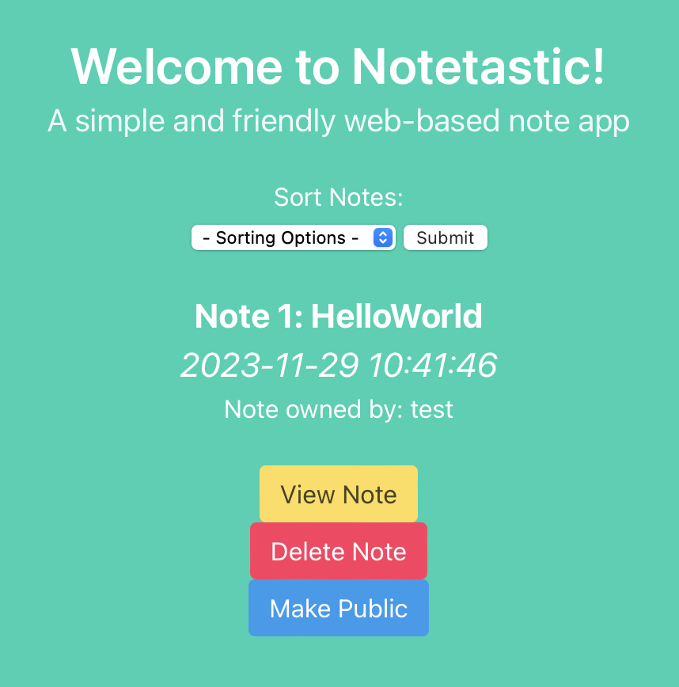
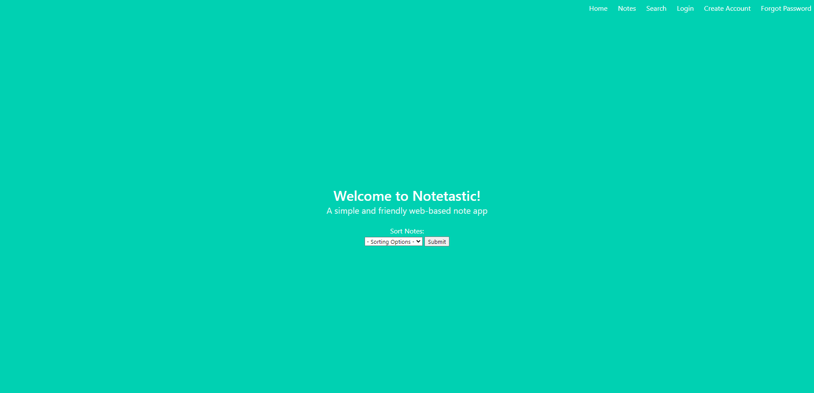
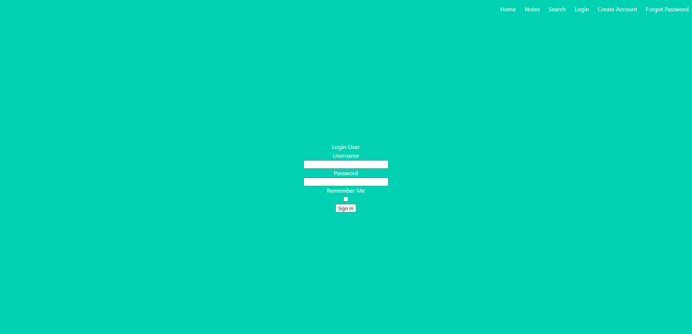
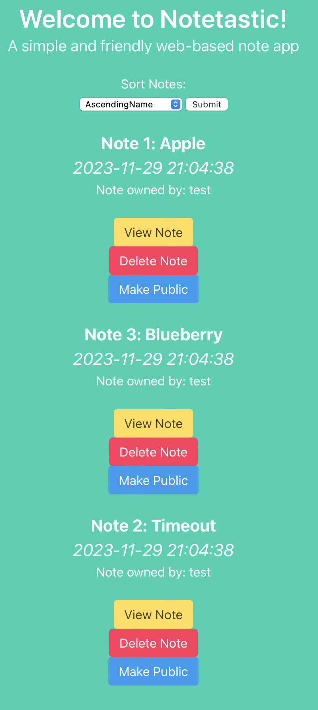
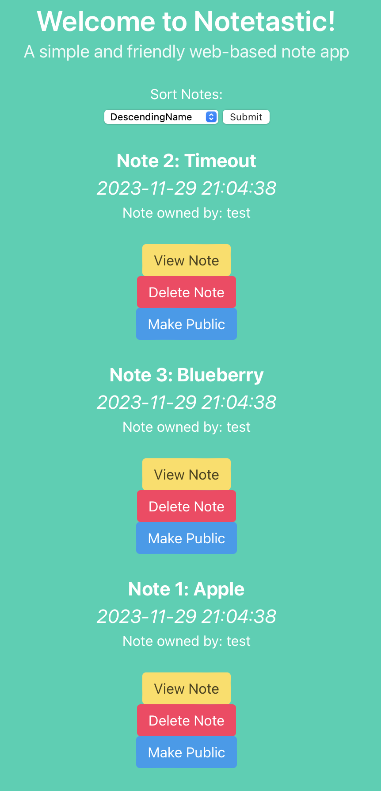

<a name="readme-top"></a>

<!-- PROJECT LOGO -->
<br />
<div align="center">
  <a href="https://github.com/addisoni/cmpe131_g4">
    
  </a>
</div>

<p align="center"> 
Addison Ivan (@addisoni) (Team Lead) <br> 
Benjamin Lim (@KatsumiLeaf) <br>
Najm Masri (@najm-masri) <br>
Stephen Shao (@stephen-shao)
</p>

<!-- TABLE OF CONTENTS -->
<details>
  <summary>Table of Contents</summary>
  <ol>
    <li>
      <a href="#about-the-project">About The Project</a>
      <ul>
        <li><a href="#built-with">Built With</a></li>
      </ul>
    </li>
    <li>
      <a href="#getting-started">Getting Started</a>
      <ul>
        <li><a href="#prerequisites">Prerequisites</a></li>
        <li><a href="#installation-and-running">Installation and running</a></li>
      </ul>
    </li>
    <li><a href="#how-to-use-our-website">How to use our website</a></li>
    <li><a href="#functional-requirements-implemented">Functional Requirements Implemeneted</li>
  </ol>
</details>

<!-- ABOUT THE PROJECT -->

## About The Project

Notetastic is a web-based note taking app that utilizies Flask-Login, Flask-SQLAlchemy, Flask-WTF, and various other
extensions to provide the user with an easy and simple way to save their thoughts and ideas online. As a user, you will
be able to do basic things such as creating your own personal account, creating and modifying your notes with different 
typefaces and font styles, have the ability to share them to the public or keep it private, and so much more!

### Built With:
* [![Flask][Flask.com]][Flask-url]

<p align="right">(<a href="#readme-top">back to top</a>)</p>

<!-- GETTING STARTED -->
## Getting Started

### Prerequisites
[](https://www.python.org/downloads/release/python-370/)

Make sure you have the following libraries installed before running Notetastic:<br>
(Run these commands in the terminal)
* Refer to and download the [Requirements](https://github.com/addisoni/cmpe131_g4/blob/main/requirements3.txt) file then install using the pip3 command:
  ```sh
  pip3 install -r requirements3.txt
  ```

* Alternatively
  ```sh
  pip3 install flask-login flask-sqlalchemy flask-wtf
  ```
  
### Installation and running

1. Clone the repo
   ```sh
   git clone https://github.com/addisoni/cmpe131_g4
   ```
2. Access the app project
   ```sh
   cd cmpe131_g4
   ```
3. Running the website within flask
   ```sh
   flask run
   ```

Alternatively, running the website via python
   ```sh
   python3 run.py
   ```

<p align="right">(<a href="#readme-top">back to top</a>)</p>

<!-- General Instructions -->
## How to use our website

<p align="right">(<a href="#readme-top">back to top</a>)</p>

<!-- Implementation -->
## Functional Requirements (To-Date)

1. Notes created on webpage are restricted to corresponding user and can change visiblity based on user's selection **(Benjamin Lim)** <br>
### The user can click on this button to make their notes private (only they can see it) or public (all users in the database can view it)
<div align="center">
  <a href="https://github.com/addisoni/cmpe131_g4">
    
  </a>
</div>

2. A simple user registration web page is incorporated for new users to create their personalized account with a username and password and security question (password reset) **(Benjamin Lim)** <br>
### Click on the "Create Account" button
<div align="center">
  <a href="https://github.com/addisoni/cmpe131_g4">
    
  </a>
</div>

### Enter your account details
<div align="center">
  <a href="https://github.com/addisoni/cmpe131_g4">
    
  </a>
</div>

3. Logout of user account **(Benjamin Lim)** <br>
### Click on the "Logout" button to logout of your current session
<div align="center">
  <a href="https://github.com/addisoni/cmpe131_g4">
    
  </a>
</div>

### Puts you back onto to the login page when you're successfully logged out
<div align="center">
  <a href="https://github.com/addisoni/cmpe131_g4">
    
  </a>
</div>
   
4. Create new notes **(Addison Ivan)**
### Notes can be created using the notes pane after logging in:
<br />
<div align="center">
  <a href="https://github.com/addisoni/cmpe131_g4">
    
  </a>
</div>

### After note is created, you can create additional notes or manage your notes on the hompepage 
<br />
<div align="center">
  <a href="https://github.com/addisoni/cmpe131_g4">
    
  </a>
</div>

5. Forgotten passwords can be reset using stored security question or known password **(Stephen Shao)**
### Users can reset password by selecting the forgot password function on the top right:
<br />
<div align="center">
  <a href="https://github.com/addisoni/cmpe131_g4">
    
  </a>a>
</div>

### Users then gets redirected to another site in which they are asked for username and security answer:
<br />
<div align="center">
  <a href="https://github.com/addisoni/cmpe131_g4">
    
  </a>a>
</div>

### Once users type in the correct answer, they will be sent to the reset password site in which they need to type in a new password and retype the new password:
<br />
<div align="center">
  <a href="https://github.com/addisoni/cmpe131_g4">
    
  </a>a>
</div>

### Once users type in the new password and confirm it, they will be relocated to the login page:
<br />
<div align="center">
  <a href="https://github.com/addisoni/cmpe131_g4">
    
  </a>a>
</div>

6. Multipletypefaces and font styles **(Najm Masri)**
    
7. Copy, paste, and duplicate note(s) **(Najm Masri)**
    
8. Modify existing user account details **(Najm Masri)**
    
9. Multiple note sorting options **(Addison Ivan)**
    
### We can sort our newly created notes in various orders, such as Ascending, Descending, or by Date:

#### Navigate to menubar and click on the Home tab
<br />
<div align="center">
  <a href="https://github.com/addisoni/cmpe131_g4">
    
  </a>
</div>
<br />
<div align="center">
  <a href="https://github.com/addisoni/cmpe131_g4">
    
  </a>
</div>

10. Search field for notes list **(Addison Ivan)**
### We can also search for and within our newly created notes, including both note title and body contents:

#### Navigate to menubar and click on the Search tab

<br />
<div align="center">
  <a href="https://github.com/addisoni/cmpe131_g4">
    
  </a>
</div>
<br />
<div align="center">
  <a href="https://github.com/addisoni/cmpe131_g4">
    
  </a>
</div>

#### You can also search for contents in the main search bar by the note's contents as well, such as "Pie" in the examplee below:
   
<div align="center">
  <a href="https://github.com/addisoni/cmpe131_g4">
    
  </a>
</div>

<p align="right">(<a href="#readme-top">back to top</a>)</p>

<!-- MARKDOWN LINKS & IMAGES -->
[Flask-url]: https://flask.palletsprojects.com/en/3.0.x/
[Flask.com]: https://img.shields.io/badge/flask-%23000.svg?style=for-the-badge&logo=flask&logoColor=white
