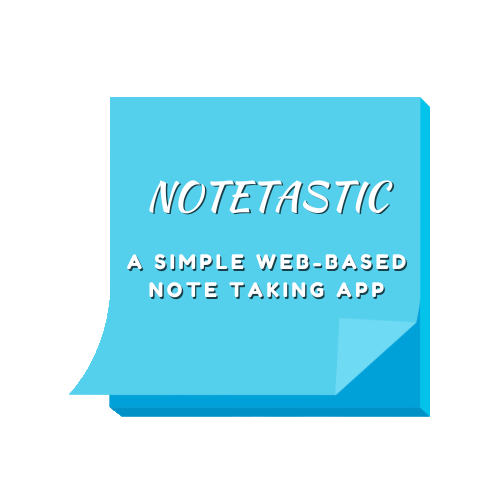

<a name="readme-top"></a>

<!-- PROJECT LOGO -->
<br />
<div align="center">
  <a href="https://github.com/addisoni/cmpe131_g4">
    
  </a>
</div>

<p align="center"> 
Addison Ivan (@addisoni) (Team Lead) <br> 
Benjamin Lim (@KatsumiLeaf) <br>
Najm Masri (@najm-masri) <br>
Stephen Shao (@stephen-shao)
</p>

<!-- TABLE OF CONTENTS -->
<details>
  <summary>Table of Contents</summary>
  <ol>
    <li>
      <a href="#about-the-project">About The Project</a>
      <ul>
        <li><a href="#built-with">Built With</a></li>
      </ul>
    </li>
    <li>
      <a href="#getting-started">Getting Started</a>
      <ul>
        <li><a href="#prerequisites">Prerequisites</a></li>
        <li><a href="#installation-and-running">Installation and running</a></li>
      </ul>
    </li>
    <li><a href="#how-to-use-our-website">How to use our website</a></li>
    <li><a href="#functional-requirements-implemented">Functional Requirements Implemeneted</li>
  </ol>
</details>

<!-- ABOUT THE PROJECT -->

## About The Project

Notetastic is a web-based note taking app that utilizies Flask-Login, Flask-SQLAlchemy, Flask-WTF, and various other
extensions to provide the user with an easy and simple way to save their thoughts and ideas online. As a user, you will
be able to do basic things such as creating your own personal account, creating and modifying your notes with different 
typefaces and font styles, have the ability to share them to the public or keep it private, and so much more!

### Built With:
* [![Flask][Flask.com]][Flask-url]

<p align="right">(<a href="#readme-top">back to top</a>)</p>

<!-- GETTING STARTED -->
## Getting Started

### Prerequisites
[](https://www.python.org/downloads/release/python-370/)

Make sure you have the following libraries installed before running Notetastic:
* Refer to the [Requirements](https://github.com/addisoni/cmpe131_g4/blob/main/requirements3.txt) file:
  ```sh
  pip3 install -r requirements3.txt
  ```

* Alternatively
  ```sh
  pip3 install flask-login flask-sqlalchemy flask-wtf
  ```
  
### Installation and running

1. Clone the repo
   ```sh
   git clone https://github.com/addisoni/cmpe131_g4
   ```
2. Access the app project
   ```sh
   cd cmpe131_g4
   ```
3. Running the website within flask
   ```sh
   flask run
   ```

Alternatively, running the website via python
   ```sh
   python3 run.py
   ```

<p align="right">(<a href="#readme-top">back to top</a>)</p>

<!-- General Instructions -->
## How to use our website

<p align="right">(<a href="#readme-top">back to top</a>)</p>

<!-- Implementation -->
## Functional Requirements (To-Date)

1. Notes created on webpage are restricted to corresponding user and can change visiblity based on user's selection **(Benjamin Lim)**
   
2. A simple user registration web page is incorporated for new users to create their personalized account with a username and password and security question (password reset) **(Benjamin Lim)**
   
3. Logout of user account **(Benjamin Lim)**
   
4. Create new notes **(Addison Ivan)**
   
5. Forgotten passwords can be reset using stored security question or known password **(Stephen Shao)**
    
6. Multipletypefaces and font styles **(Najm Masri)**
    
7. Copy, paste, and duplicate note(s) **(Najm Masri)**
    
8. Modify existing user account details **(Najm Masri)**
    
9. Multiple note sorting options **(Addison Ivan)**
    
10. Search field for notes list **(Addison Ivan)**

<p align="right">(<a href="#readme-top">back to top</a>)</p>

<!-- MARKDOWN LINKS & IMAGES -->
[Flask-url]: https://flask.palletsprojects.com/en/3.0.x/
[Flask.com]: https://img.shields.io/badge/flask-%23000.svg?style=for-the-badge&logo=flask&logoColor=white
