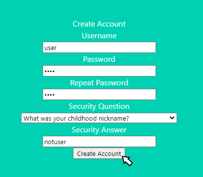

<a name="readme-top"></a>

<!-- PROJECT LOGO -->
<br />
<div align="center">
  <a href="https://github.com/addisoni/cmpe131_g4">
    
  </a>
</div>

<p align="center"> 
Addison Ivan (@addisoni) (Team Lead) <br> 
Benjamin Lim (@KatsumiLeaf) <br>
Najm Masri (@najm-masri) <br>
Stephen Shao (@stephen-shao)
</p>

<!-- TABLE OF CONTENTS -->
<details>
  <summary>Table of Contents</summary>
  <ol>
    <li>
      <a href="#about-the-project">About The Project</a>
      <ul>
        <li><a href="#built-with">Built With</a></li>
      </ul>
    </li>
    <li>
      <a href="#getting-started">Getting Started</a>
      <ul>
        <li><a href="#prerequisites">Prerequisites</a></li>
        <li><a href="#installation-and-running">Installation and running</a></li>
      </ul>
    </li>
    <li><a href="#user-account-functions">User Account Functions</a></li>
      <ul>
        <li><a href="#creating-a-new-account">Creating a new account</a></li>
        <li><a href="#logging-in">Logging in</a></li>
        <li><a href="#logging-out">Logging out</a></li>
        <li><a href="#forgot-password">Forgot password</a></li>
        <li><a href="#modify-account-details">Modify account details</a></li>
      </ul>
    <li><a href="#notes-functions">Notes Functions</li>
    <li><a href="#functional-requirements-to-date">Functional Requirements (To-Date)</li>
  </ol>
</details>

<!-- ABOUT THE PROJECT -->
## About The Project

Notetastic is a web-based note taking app that utilizies Flask-Login, Flask-SQLAlchemy, Flask-WTF, and various other
extensions to provide the user with an easy and simple way to save their thoughts and ideas online. As a user, you will
be able to do basic things such as creating your own personal account, creating and modifying your notes with different 
typefaces and font styles, have the ability to share them to the public or keep it private, and so much more!

### Built With:
* [![Flask][Flask.com]][Flask-url]

<p align="right">(<a href="#readme-top">back to top</a>)</p>

<!-- GETTING STARTED -->
## Getting Started

### Prerequisites
[](https://www.python.org/downloads/release/python-370/)

Make sure you have the following libraries installed before running Notetastic:<br>
(Run these commands in the terminal)
* Refer to and download the [Requirements](https://github.com/addisoni/cmpe131_g4/blob/main/requirements3.txt) file then install using the pip3 command:
  ```sh
  pip3 install -r requirements3.txt
  ```

* Alternatively
  ```sh
  pip3 install flask-login flask-sqlalchemy flask-wtf
  ```
  
### Installation and running

1. Clone the repo
   ```sh
   git clone https://github.com/addisoni/cmpe131_g4
   ```
2. Access the app project
   ```sh
   cd cmpe131_g4
   ```
3. Running the website within flask
   ```sh
   flask run
   ```

Alternatively, running the website via python
   ```sh
   python3 run.py
   ```

<p align="right">(<a href="#readme-top">back to top</a>)</p>

<!-- General Instructions -->
## User Account Functions
### Creating a new account
1. Click on "**Create Account**" button on top
<div align="center">
  <a href="https://github.com/addisoni/cmpe131_g4">
    
  </a>
</div>

2. Now enter your account details 
<div align="center">
  <a href="https://github.com/addisoni/cmpe131_g4">
    
  </a>
</div>

### Logging in
1. After creating your new account, you'll be sent to our login page where you enter your account details
<div align="center">
  <a href="https://github.com/addisoni/cmpe131_g4">
    
  </a>
</div>

### Logging out
1. Click on the "**Logout**" button to logout of your current session
<div align="center">
  <a href="https://github.com/addisoni/cmpe131_g4">
    
  </a>
</div>

2. Puts you back onto to the login page when you're successfully logged out
<div align="center">
  <a href="https://github.com/addisoni/cmpe131_g4">
    
  </a>
</div>

### Forgot password
1. Click on "**Forgot Password**" button on top
<div align="center">
  <a href="https://github.com/addisoni/cmpe131_g4">
    
  </a>
</div>

2. Enter the username and the correct security answer associated with it
   
4. Once successful, you will be redirected to the "**Reset Password**" where you can create a new password which will replace your current one

### Modify account details
1. Click on "**Modify Account**" button on top

2. Enter the user information you want to change, i.e. username, password, security question/answer then click the "**Modify Account**" button to implement those changes to your account

## Notes Functions

### Creating notes
1. After logging in, you will be redirected to the notes creation page where you can create new notes
<div align="center">
  <a href="https://github.com/addisoni/cmpe131_g4">
    
  </a>
</div>

2. To save the note after inputting the title and body, click on "**Save Note**"

3. After saving, you will be redirected to the home page where you can view, delete, modify, or change the note's visibility to other users.

4. To create another new note, click the "**Notes**" button on top and do the same thing as mentioned in step 2

### Adding different typefaces and font styles
1. You can modify your text with different typefaces and font styles using the buttons under '**Body**'
<div align="center">
  <a href="https://github.com/addisoni/cmpe131_g4">
    
  </a>
</div>

### Searching for notes
1. Navigate to the bar on top and click on the "**Search**" tab
<div align="center">
  <a href="https://github.com/addisoni/cmpe131_g4">
    
  </a>
</div>

2. You can search for notes containing the title or body that you inputted as shown below
<div align="center">
  <a href="https://github.com/addisoni/cmpe131_g4">
    
    
    
  </a>
</div>

### Sorting notes
1. If you aren't already on it, click on the "**Home**" tab on top
   
2. Here, you can sort by the title ascending/descending or by date created

<p align="right">(<a href="#readme-top">back to top</a>)</p>

<!-- Implementation -->
## Functional Requirements (To-Date)

1. Notes created on webpage are restricted to corresponding user and can change visiblity based on user's selection **(Benjamin Lim)** 

2. A simple user registration web page is incorporated for new users to create their personalized account with a username and password and security question (password reset) **(Benjamin Lim)** 

3. Logout of user account **(Benjamin Lim)**
   
4. Create new notes **(Addison Ivan)**

5. Forgotten passwords can be reset using stored security question or known password **(Stephen Shao)**

6. Multipletypefaces and font styles **(Najm Masri)**
### Notes can be written using multipletypefaces and font styles:
<br />
<div align="center">
  <a href="https://github.com/addisoni/cmpe131_g4">
    
  </a>
</div>

### You can use the italics, underline, and bold feature as well include links, change font size, add numbers or bullet points, and undo.
        
8. Modify existing user account details **(Najm Masri)**
    
10. Multiple note sorting options **(Addison Ivan)**
    
### We can sort our newly created notes in various orders, such as Ascending, Descending, or by Date:

#### Navigate to menubar and click on the Home tab
<br />
<div align="center">
  <a href="https://github.com/addisoni/cmpe131_g4">
    
  </a>
</div>
<br />
<div align="center">
  <a href="https://github.com/addisoni/cmpe131_g4">
    
  </a>
</div>

10. Search field for notes list **(Addison Ivan)**
### We can also search for and within our newly created notes, including both note title and body contents:

#### Navigate to menubar and click on the Search tab

<br />
<div align="center">
  <a href="https://github.com/addisoni/cmpe131_g4">
    
  </a>
</div>
<br />
<div align="center">
  <a href="https://github.com/addisoni/cmpe131_g4">
    
  </a>
</div>

#### You can also search for contents in the main search bar by the note's contents as well, such as "Pie" in the examplee below:
   
<div align="center">
  <a href="https://github.com/addisoni/cmpe131_g4">
    
  </a>
</div>

<p align="right">(<a href="#readme-top">back to top</a>)</p>

<!-- MARKDOWN LINKS & IMAGES -->
[Flask-url]: https://flask.palletsprojects.com/en/3.0.x/
[Flask.com]: https://img.shields.io/badge/flask-%23000.svg?style=for-the-badge&logo=flask&logoColor=white
